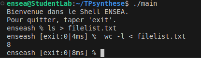

# TP synthèse
## Ensea in the Shell
### The aim of this practical project is to create a microshell, i.e. a command-line interface for executing system commands.

**Q1. Display a welcome message and a simple prompt**    
I created a function that displays a messsage and then call this function in my main.

**Q2. Execution of the entered command and return to the prompt**  
I created two functions, one to read the entered commande and the other one to execute this command. And I use my previous function displayMessage in order to display the prompt. The readCommand function reads the command entered and removes the last character corresponding to the backspace. The executeCommand function creates a child process with the fork function, which allows the shell to execute each command in a separate process, ensuring its smooth operation while isolating command errors and signals. Then execlp execute the command.

**Q3. Management of the shell output with the command ”exit”**  
I am reusing the function created in question 1. Our code is working :  

**Q4. Return code display**  
The status must be retrieved in order to know whether the command ended normally or was stopped by a signal, then the prompt must be stored in a variable and updated after each execution.

**Q5. Measurement of order execution time** 
I create an executionTime function that calculates the execution time, and retrieve the time using the clock_gettime command.

**Q6. Execution of a complex command**
To handle more complex commands, we're going to use an array of caracter strings, so we need to replace the execlp command with execvp. The strtok function is used to split the command into an array of arguments, based on spaces. This makes it possible to handle complex commands with several arguments.

**Q7. "Management of redirections to stdin and stdout with ’<’ and ’>’**  
I create a handleRedirection function, this function searches for redirections (< and >) in the command and opens the corresponding files. Using the O_WRONLY, O_CREAT, O_TRUNC and O_RDONLY functions.

###CONCLUSION  
This project enabled me to master the key concepts needed to create an interactive shell. I learned how to design a REPL loop to read, execute and display the results of commands, while interacting with the system via calls like fork, execvp, and waitpid. Process and flow management (stdin, stdout) introduced me to file descriptors, redirection with dup2 and fine string manipulation with strtok. I also discovered how to measure performance with clock_gettime and handle errors or signals. This project turned me from a command-line user into a designer, giving me an insight into the inner workings of a shell.
