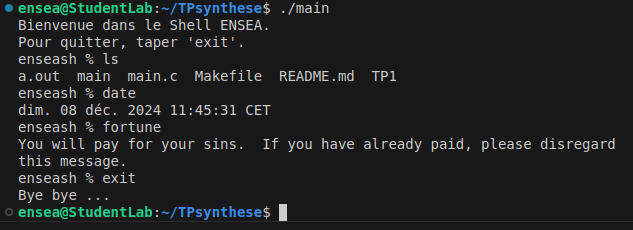

# TP synthèse
## Ensea in the Shell
### The aim of this practical project is to create a microshell, i.e. a command-line interface for executing system commands. (French version below)

**Q1. Display a welcome message and a simple prompt**    
I created a function that displays a messsage and then call this function in my main.

**Q2. Execution of the entered command and return to the prompt**  
I created two functions, one to read the entered commande and the other one to execute this command. And I use my previous function displayMessage in order to display the prompt. The readCommand function reads the command entered and removes the last character corresponding to the backspace. The executeCommand function creates a child process with the fork function, which allows the shell to execute each command in a separate process, ensuring its smooth operation while isolating command errors and signals. Then execlp execute the command.

**Q3. Management of the shell output with the command ”exit”**  
I am reusing the function created in question 1. Our code is working :  

**Q4. Return code display**  
The status must be retrieved in order to know whether the command ended normally or was stopped by a signal, then the prompt must be stored in a variable and updated after each execution.  

**Q5. Measurement of order execution time**   
I create an executionTime function that calculates the execution time, and retrieve the time using the clock_gettime command.   

**Q6. Execution of a complex command**  
To handle more complex commands, we're going to use an array of caracter strings, so we need to replace the execlp command with execvp. The strtok function is used to split the command into an array of arguments, based on spaces. This makes it possible to handle complex commands with several arguments.  

**Q7. "Management of redirections to stdin and stdout with ’<’ and ’>’**  
I create a handleRedirection function, this function searches for redirections (< and >) in the command and opens the corresponding files. Using the O_WRONLY, O_CREAT, O_TRUNC and O_RDONLY functions.  

### CONCLUSION  
This project enabled me to master the key concepts needed to create an interactive shell. I learned how to design a REPL loop to read, execute and display the results of commands, while interacting with the system via calls like fork, execvp, and waitpid. Process and flow management (stdin, stdout) introduced me to file descriptors, redirection with dup2 and fine string manipulation with strtok. I also discovered how to measure performance with clock_gettime and handle errors or signals. This project turned me from a command-line user into a designer, giving me an insight into the inner workings of a shell.

### French version

**Q1. Afficher un message de bienvenue et un prompt simple**    
J'ai créé une fonction qui affiche un message et j'appelle cette fonction dans mon main.

**Q2. Exécution de la commande saisie et retour au prompt**  
J'ai créé deux fonctions, l'une pour lire la commande saisie et l'autre pour exécuter cette commande. Et j'utilise ma fonction précédente displayMessage pour afficher l'invite. La fonction readCommand lit la commande saisie et supprime le dernier caractère correspondant au retour arrière. La fonction executeCommand crée un processus enfant avec la fonction fork, qui permet à l'interpréteur de commandes d'exécuter chaque commande dans un processus séparé, assurant ainsi son bon fonctionnement tout en isolant les erreurs et les signaux de commande. Ensuite, execlp exécute la commande.

**Q3. Gestion de la sortie du shell avec la commande « exit »**  
Je réutilise la fonction créée à la question 1.  

**Q4. Affichage du code de retour**  
Le status doit être récupéré afin de savoir si la commande s'est terminée normalement ou a été stoppée par un signal, puis le prompt doit être stockée dans une variable et mis à jour après chaque exécution.  

**Q5. Mesure du temps d'exécution d'un ordre**  
Je crée une fonction executionTime qui calcule le temps d'exécution, et je récupère le temps à l'aide de la commande clock_gettime.  

**Q6. Exécution d'une commande complexe**  
Pour gérer des commandes plus complexes, nous allons utiliser un tableau de chaînes de caractères, et nous devons donc remplacer la commande execlp par execvp. La fonction strtok est utilisée pour découper la commande en un tableau d'arguments, basé sur les espaces. Cela permet de traiter des commandes complexes comportant plusieurs arguments.  

**Q7. « Gestion des redirections vers stdin et stdout avec '<' et '>'**.  
Je crée une fonction handleRedirection, cette fonction recherche les redirections (< et >) dans la commande et ouvre les fichiers correspondants. En utilisant les fonctions O_WRONLY, O_CREAT, O_TRUNC et O_RDONLY.  

### CONCLUSION   
Ce projet m'a permis de maîtriser les concepts clés nécessaires à la création d'un shell interactif. J'ai appris à concevoir une boucle REPL pour lire, exécuter et afficher les résultats des commandes, tout en interagissant avec le système via des appels comme fork, execvp, et waitpid. La gestion des processus et des flux (stdin, stdout) m'a fait découvrir les descripteurs de fichiers, la redirection avec dup2 et la manipulation de chaînes de caractères avec strtok. J'ai également découvert comment mesurer le temps d'exécution avec clock_gettime et comment gérer les erreurs ou les signaux. Ce projet m'a fait passer d'utilisateur de ligne de commande à concepteur, en me donnant un aperçu du fonctionnement interne d'un shell.
